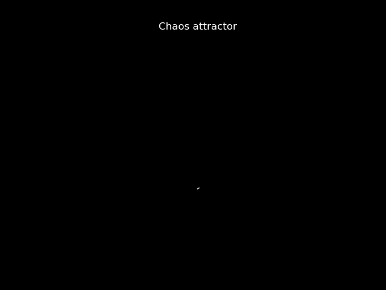
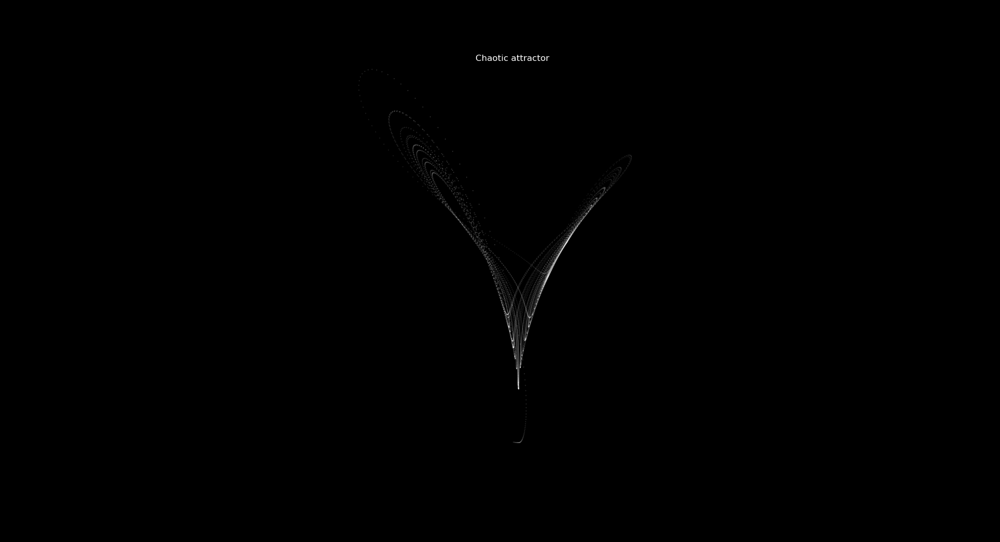
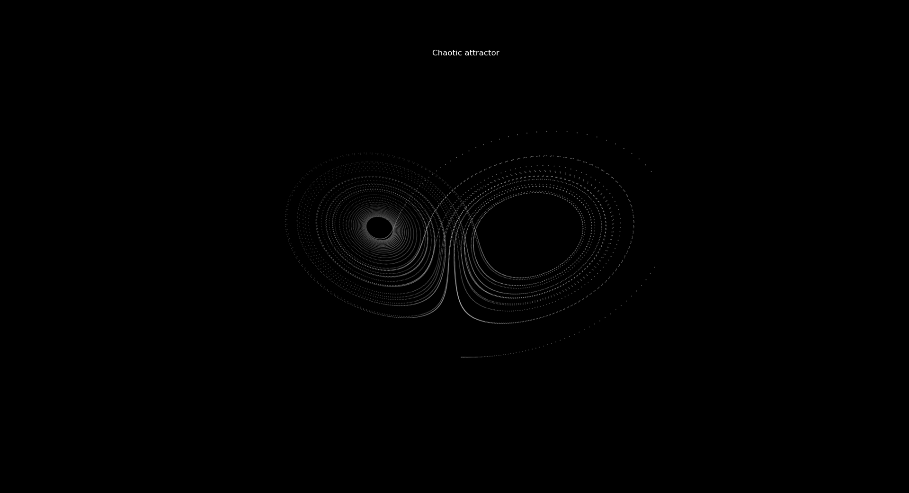

` Reference wikipedia for lorenz attractor `

# Lorenz Attractor

Lorenz attractor animated using matplotlib,
simple solve using scipy ODE solver. Nothing
insane.

Ever heard of the butterfly effect? Used in 
weather calculations, circuits, machine learning... 
lots of use cases.

## Extra Figs

