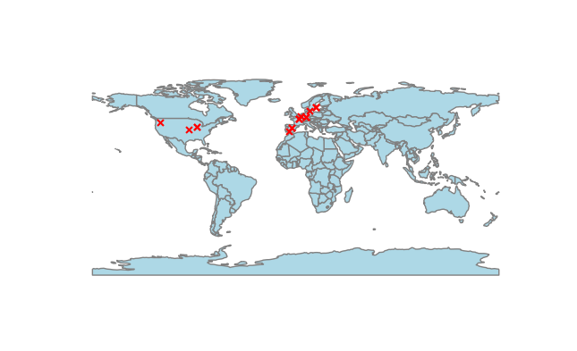

` Reference scapy & geopandas documentation`

# Networks

Learning scapy lib in python. Small simple codes to do 1 main
thing that looks to be fun. No monolithic big code. Focus on 
using lots of libraries to explore what is out there.

Current list of progs
* Packet sniffer 
* Geo-plot IPs

## Packet Sniffer

Sniffs packets, filters for what we want (simple src, dst). May
visit later to create more complex filters, those that are found
in old Phrack articles or relate to some CVE - ah thats a good
idea huh? Recreate certain networking CVEs!

## Geo-Plot IP

Gather IPs using scapy and plot on static geopandas map.
Points conversion via shapley points lib. I could make this
look better... but i don't really care to do so right now.
