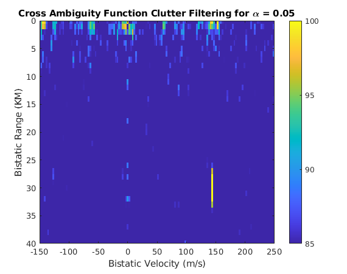

# Software Defined Radios

Code pertaining to software defined radio projects.

## FM Capture; no demoulation

There is a simple FM capture, no demoulation in python. Frequency and other paramters are all hard coded, sorry. Easy to change if needed. Implemented using RTL SDR; also first time using such a device. Really cool low-cost tech.

## Simulated Static Passive Radar

Also implemented Radar, but it does not have all the necessary code. Thinking of submitting this as open-source software to some project in radar technology. Maybe creating customg GNU Radio blocks for this too would be a good idea.

Check out figs dir, interesting plots in there...

